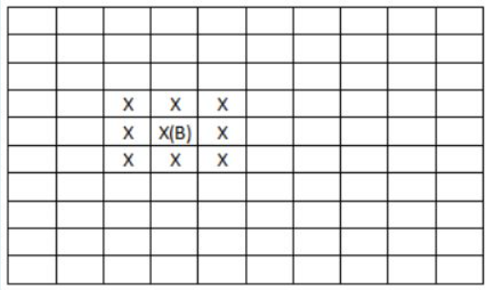
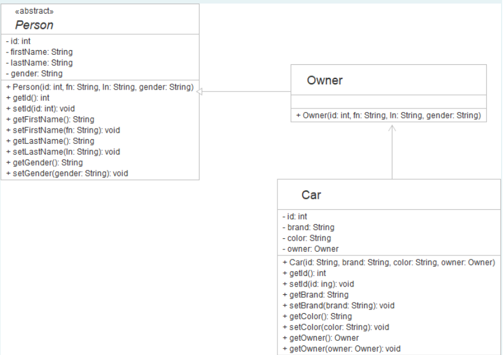

## Question 1: Digit Addition from a 9-Digit Number

Write a program to add digits from a given 9-digit number according to the following conditions:

1. If the middle digit is an **odd number**, add all digits which are in the **odd position**.
2. If the middle digit is an **even number**, add all digits which are in the **even position**.

*Note: The position starts at 0 index (even number).*

### Example:

| **Input** | **Result** |
| --- | --- |
| 214532369 | 14 |

---

## Question 2: Case-Based Sentence Encryption

Your task is to encrypt the message with a certain number of words according to the following conditions:

1. If the word is in the **even position** (starting counting from 0), convert to **UPPERCASE**; otherwise, convert to **lowercase**.
2. **Reverse** characters in each word.

The input is a number of words in a sentence and the sentence itself. The output is an encrypted sentence.

### Example:

| **Input** | **Result** |
| --- | --- |
| 15   Java applications are typically compiled to bytecode that can run on any Java virtual machine | AVAJ snoitacilppa ERA yllacipyt DELIPMOC ot EDOCETYB taht NAC nur NO yna AVAJ lautriv ENIHCAM |

---

## Question 3: Min/Max Number Finder

Write a Java program to find the **top three maximum numbers** and **last three minimum numbers** from the given list of numbers.

* The first input is the size of the list.
* The second input is the list of numbers.

*Hint: Use `double` as a datatype.*

### Example:

| **Input** | **Result** |
| --- | --- |
| 10   2.3 1 45.2 6.2 77.1 -470 490 -795 189 42 | 490.0 189.0 77.1   -795.0 -470.0 1.0 |
| 10   -39 234 -644 666 897 806 -313 969 245 -15 | 969.0 897.0 806.0   -644.0 -313.0 -39.0 |

---

## Question 4: Bomber Man Lite 2D

You are creating a Bomber Man Lite 2D with a field size of **10X10**.
The rule is a player can put a bomb in any cell of the field. When a bomb explores, it will destroy a cell itself and all **adjacent** cells in **8 directions** (i.e., up, down, left, right, and on diagonals).

Your task is to write a program to count the number of destroyed cells in the field when the number of bombs and position of bombs are provided.

**Input:**

* The first line of the input is a number of bombs in the field.
* The following lines are the position of each bomb (row and column) located in the field.

**Output:**

* The total number of destroyed cells in the field.

### Example:

| **Input** | **Result** |
| --- | --- |
| 2   4 3   8 8 | 18 |

---

## Question 5: Person, Owner, and Car Implementation

Write Java code according to the given description and UML diagram shown below.

* The **Person** is an abstract class which provides a template for person information.
* The class **Owner** inherits properties of Person.
* The class **Car** represents a car having id, brand, and color. It is associated with an owner.

The driver class `Tester` is provided in the answer box for testing the system. Do not modify the driver class.

*Hint: Only the `Tester` class can be a public class.*

### Example:

| **Input** | **Result** |
| --- | --- |
| 2   111 John Wick male   11112015 Mercedes-AMG-GT Yellow   007 James Bond male   15012016 Aston-Martin Gray | --- Car Owner List ---   id: 11112015 brand: Mercedes-AMG-GT color: Yellow owner: John Wick   id: 15012016 brand: Aston-Martin color: Gray owner: James Bond |