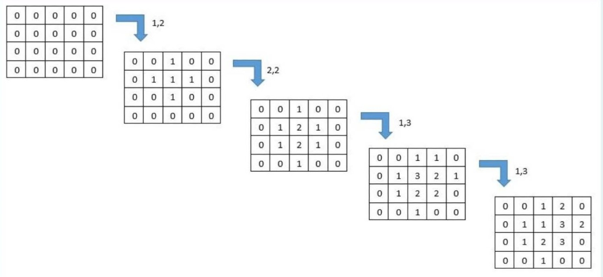
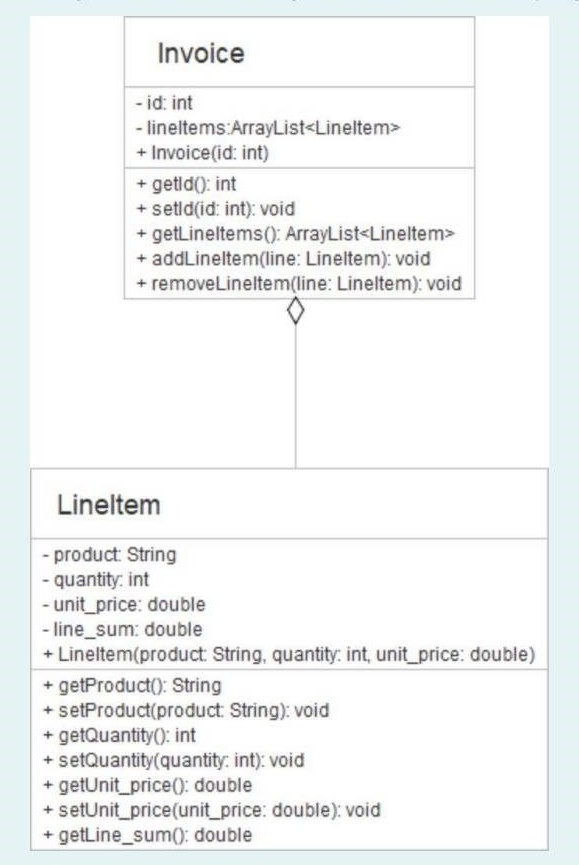

## Question 1: List Element Swapping

Write a program to swap the elements from the given order of swap as a pair of positions and print the result. For example, if the given list of numbers is:

`1 2 3 4 5 6 7 8 9 0`

And there are 5 given pairs of swap: `(0,3), (4,6), (7,5), (9,1), and (2,1)`, the result after each swap (in the given order) will be:

* `0 3 -> 4 2 3 1 5 6 7 8 9 0`
* `4 6 -> 4 2 3 1 7 6 5 8 9 0`
* `7 5 -> 4 2 3 1 7 8 5 6 9 0`
* `9 1 -> 4 0 3 1 7 8 5 6 9 2`
* `2 1 -> 4 3 0 1 7 8 5 6 9 2`

Therefore the result from the last swap is: `4 3 0 1 7 8 5 6 9 2`

**Input Format:**

1. A number indicating the size of the given list.
2. A list of integers.
3. A number indicating the number of swaps.
4. A list of swap positions as pairs.

### Example:

| **Input** | **Result** |
| --- | --- |
| 10   1 2 3 4 5 6 7 8 9 0   5   0 3   4 6   7 5   9 1   2 1 | 4 3 0 1 7 8 5 6 9 2 |
| 4   1 2 3 0   8   0 1   1 2   3 2   2 0   3 1   2 3   0 1   3 0 | 2 0 3 1 |

---

## Question 2: Seed Number Addition

Write a program to add the next 20 numbers from the given seed number according to the following conditions:

1. If the seed number is odd, add odd numbers including the seed as well.
2. If the seed number is even, add even numbers including the seed as well.

The input is the seed number. The output is the result of the adding.

**Example:**
If 55 is a seed number, the result is:

### Example:

| **Input** | **Result** |
| --- | --- |
| 55 | 715 |
| 46 | 616 |

---

## Question 3: Sentence Encryption (Reverse & Swap)

Given a number of words in a sentence and the sentence, write a program to encrypt the sentence as follows:

1. Reverse the sentence.
2. For each word, set to lowercase; then, if there are more than 2 characters, swap the first and last character.

**Input Format:**

1. Size of the sentence (number of words contained in the text).
2. The whole line of the sentence.

### Example:

| **Input** | **Result** |
| --- | --- |
| 2   Hello Everyone | everyone oellh |
| 15   He found the end of the rainbow and was surprised at what he found there | ehert dounf eh thaw ta durprises saw dna wainbor eht fo dne eht dounf eh |

---

## Question 4: Adjacent Element Swapping

Write a program to swap the adjacent elements as the following conditions:

1. If the size of the given element list is even, then swap each pair of adjacent elements.
2. If the size of the given element list is odd, then swap each pair of adjacent elements except the last element.

**Example:**
If the input list is `1 2 3 0`, the output is `2 1 0 3`.

### Example:

| **Input** | **Result** |
| --- | --- |
| 5   5 1 4 2 8 | 1 5 2 4 8 |
| 4   1 2 3 0 | 2 1 0 3 |

---

## Question 5: Sentence Encryption (Uppercase & Sort)

Write a program to encrypt the message by manipulating each word in the following order:

1. Change each character to uppercase.
2. Sort the word by character order.

**Input Format:**

1. Size of the text (number of words).
2. The whole line of text.

### Example:

| **Input** | **Result** |
| --- | --- |
| 2   Hello Everyone | EHLLO EEENORVY |
| 5   I Love Java Programming Course | I ELOV AAJV AGGIMMNOPRR CEORSU |

---

## Question 6: Divisibility Logic Addition

Write a program to add or subtract the previous 5 numbers and next 5 numbers from the given seed number (including the seed number as well) according to the following conditions:

1. Add the number if the number is **not** divisible by 3.
2. Subtract the number if the number is divisible by 3.

**Example:**
If 30 is a seed number, the result is:

### Example:

| **Input** | **Result** |
| --- | --- |
| 30 | 150 |

---

## Question 7: Grid Click Simulation

Given a grid (two-dimensional array) containing numbers, write a program to change the number by 1 per click to the clicked cell and its adjacent cells (i.e., right, left, top, and bottom). The number will be changed up to 3. If the cell already contains a value of 3, the number will be changed back to 1 again.

For example, giving the array of 4 rows and 5 columns, if the clicked position  is at (1, 2), (2, 2), (1, 3) and (1, 3) respectively, the result is shown as below.

**Input Format:**

1. Two numbers indicating row and column and the arrays.
2. A number indicating the number of clicks.
3. The list of clicked positions in pairs of row and column.

### Example:

| **Input** | **Result** |
| --- | --- |
| 4 5   4   1 2   2 2   1 3   1 3 | 0 0 1 2 0   0 1 1 3 2   0 1 2 3 0   0 0 1 0 0 |

---

## Question 8: Invoice UML Implementation

Given the UML Class Diagram below, write a program accordingly.

**Logic Requirements:**

* **Invoice Class:** Holds `LineItem` objects in an `ArrayList`.
* `addLineItem`: Checks if the item exists. If yes, prints "This line item already exists." Otherwise, adds it.
* `removeLineItem`: Checks if the item exists. If yes, removes it. Otherwise, prints "This line item does not exist."

* **LineItem Class:** Attributes include `product`, `quantity`, `unit_price`, and `line_sum`.
* `line_sum` is calculated as .
* `setQuantity` and `setUnit_price` must update `line_sum` whenever called.

**Note:** Do not modify the provided driver class.
