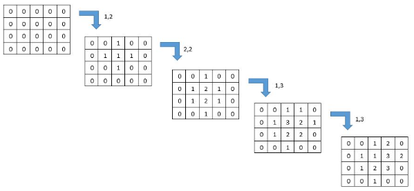

## Question 1

Write a program to add the next 20 numbers from the given seed number according to the following conditions:

1. If the seed number is odd, add odd numbers including the seed as well.
2. If the seed number is even, add even numbers including the seed as well.

The input is the seed number. The output is the result of the adding.

**For example if 55 is a seed number. Then the result is:**


### For example:

| **Input** | **Result** |
| --- | --- |
| 55 | 715 |
| 46 | 616 |

---

## Question 2

Write a program to encrypt the given sentence with following steps:

1. Convert a sentence to uppercase.
2. Swap a character with its swap pair.
3. Reverse a sentence and print.

**The input consists of 3 parts:**

1. A sentence
2. Number of swap pair
3. Swap pair

**For example, the input is:**

```text
Hello Java
2
E T
A R

```

**The output is:**
`RVRJ OLLTH`

**Here are steps of encryption.**

1. Convert a sentence to uppercase -> `HELLO JAVA`
2. Swap a character with its swap pair. -> `HTLLO JRVR`
3. Reverse a sentence and print. -> `RVRJ OLLTH`

### For example:

| **Input** | **Result** |
| --- | --- |
| Hello Java <br> 2 <br> E T <br> A R | VRJ OLLTH |

---

## Question 3

Write a program to swap elements in the given list of number such that odd numbers and even numbers are sorted.

**For example, the given list of number is:**
`9 7 6 4 5 2`

| 9 | 7 | 6 | 4 | 5 | 2 |
| --- | --- | --- | --- | --- | --- |
| Odd | Odd | Even | Even | Odd | Even |

* Odd numbers are: 
* Even numbers are: 

**Put the numbers back to the odd and even position with the sorted order as follow:**

| 5 | 7 | 2 | 4 | 9 | 6 |
| --- | --- | --- | --- | --- | --- |
| Odd | Odd | Even | Even | Odd | Even |

**The final swap list is:** `5 7 2 4 9 6`

### For example:

| **Input** | **Result** |
| --- | --- |
| 6 <br> 9 7 6 4 5 2 | 5 7 2 4 9 6 |

---

## Question 4

Giving a grid (two-dimensional array) containing numbers, write a program to change the number by 1 per click to the clicked cell and its adjacent cells (i.e., right cell, left cell, top cell, bottom cell). The number will be changed up to 3. If the cell already contains value of 3, the number will be changed back to 1 again.

**For example, giving the array of 4 rows and 5 columns, if the clicked position is at (1,2) (2,2), (1,3) and (1,3) respectively, the result is shown as below.**



The input has three parts. The first part is two numbers indicate row and column and the arrays. The second part is a number indicate number of clicks. The last part is the list of clicked position in a pair of row and column.

### For example:

| **Input** | **Result** |
| --- | --- |
| 4 5 <br> 4 <br> 1 2 <br> 2 2 <br> 1 3 <br> 1 3 | 0 0 1 2 0 <br> 0 1 1 3 2 <br> 0 1 2 3 0 <br> 0 0 1 0 0 |

---

## Question 5


The **Owner** class represents a vehicle owner, storing their name and a list of owned vehicles. The `addVehicle` method adds a vehicle to the list if it is not already present. The `move` method moves a specified vehicle using the given speed and distance via the `move` method of the **Vehicle** class.

The **Vehicle** class represents any type of vehicle, storing its brand, type, model, color, and total accumulated distance (initialized to 0). The `printInfo` method displays vehicle details. The `move` method is abstract and must be implemented by concrete subclasses.

The **Car** class is a concrete subclass of *Vehicle* with additional attributes: id, consumption rate, and power consumption (initialized to 0). Upon creation, it sets the type as "Car." The `move` method updates the total distance and calculates power consumption as:

power comsumption = distance / comsumption rate

If speed is , no update occurs. The `printInfo` method extends *Vehicle’s* `printInfo` by also displaying total power consumption.

The **Bicycle** class is another concrete subclass of **Vehicle**, setting its type as "Bicycle" upon creation. Its `move` method updates the total distance unless the speed is , in which case no changes occur.

The provided outline includes a structural guide. **Do not modify the VehicleTester class**, as changes may cause errors.
